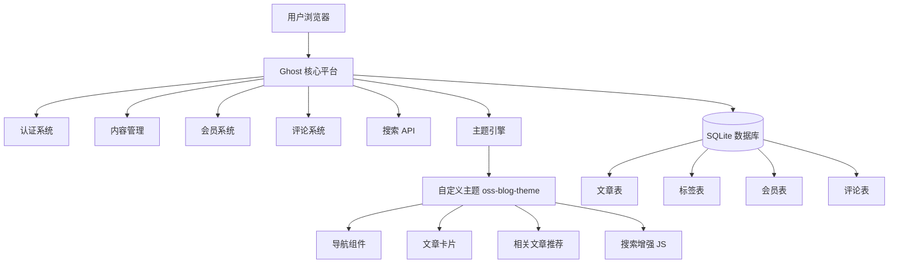

# 开源软件实验博客系统

> 基于 Ghost 开源博客系统的二次开发实验项目

## 项目简介

本项目是《开源软件与新技术》课程实验01的成果，基于 [Ghost](https://github.com/TryGhost/Ghost) 开源博客平台进行二次开发，完成了一个**可注册、可写作、可评论、可搜索**的个人博客系统。

项目在不修改 Ghost 核心代码的前提下，通过自定义主题和 API 集成实现了多项扩展功能，展示了开源软件的获取、使用、分析与规范开发的完整流程。

## 功能清单

### 核心功能（MVP）
- ✅ 用户注册与登录（管理员 + 普通会员）
- ✅ 文章创建、编辑、发布
- ✅ 标签分类与浏览
- ✅ 会员评论系统
- ✅ 关键词搜索功能
- ✅ 本地 SQLite 数据存储
- ✅ 数据备份与恢复

### 自定义主题
- ✅ 自定义导航栏（中文化、可访问性增强）
- ✅ 文章卡片样式优化（悬停效果、阅读时间显示）
- ✅ 文章详情页元数据展示
- ✅ 响应式布局（桌面端 + 移动端）
- ✅ 自定义 CSS 样式（oss-custom.css）

### 自主扩展功能
- ✅ **相关文章推荐**：基于标签相似度为读者推荐相关内容
- ✅ **搜索增强**：搜索弹窗、关键词高亮、无结果提示、热门标签建议
- ✅ **键盘快捷键**：Ctrl/Cmd + K 快速打开搜索，上下箭头导航结果

## 技术栈

| 组件 | 版本 | 说明 |
|------|------|------|
| 操作系统 | Windows 11 | 开发与运行环境 |
| Node.js | v22.23.1 LTS | Ghost 运行环境（要求 ^22.23.1） |
| npm | 11.17.0 | 包管理 |
| Ghost | v6.59.0 | 博客核心平台 |
| Ghost CLI | 1.32.3 | Ghost 安装与管理工具 |
| SQLite | 3.x | 本地数据库（随 Ghost 安装） |
| Handlebars | 4.x | 主题模板引擎 |
| Git | 2.45.1 | 版本控制 |

## 系统架构



**修改边界说明**：
- ✅ 允许修改：`theme/oss-blog-theme/` 主题源码、`docs/` 文档、`tests/` 测试、`scripts/` 脚本
- ❌ 禁止修改：`runtime/current/` Ghost 核心代码、`runtime/versions/` 版本文件

## 环境要求

### 必需软件
1. **Node.js 22.23.1 LTS**（必须，Ghost 6.x 不支持 Node 24）
   - 下载地址：https://nodejs.org/download/release/v22.23.1/
   - Windows 用户可下载 zip 便携版，无需安装
2. **Git 2.40+**
3. **npm 或 pnpm**

### 版本检查命令
```bash
node --version    # 应显示 v22.23.1
npm --version     # 应显示 11.x
git --version     # 应显示 2.40+
```

## 安装与运行

### 快速开始

```bash
# 1. 克隆项目
git clone <仓库地址>
cd oss-blog

# 2. 安装项目依赖（Ghost CLI）
npm install

# 3. 安装 Ghost（首次运行）
cd runtime
ghost install local --no-start --no-setup

# 4. 配置数据库路径
# 编辑 config.development.json，确保 database.connection.filename 指向正确路径

# 5. 启动 Ghost
ghost start --development

# 6. 完成初始化
# 访问 http://localhost:2368/ghost 创建管理员账号
```

### 使用项目脚本（推荐）

项目提供了 Node.js 22 便携版和包装脚本，简化启动流程：

```bash
# Windows PowerShell
# 启动 Ghost
.\scripts\start.ps1

# 停止 Ghost
.\scripts\stop.ps1
```

### 验证安装

启动成功后，访问以下地址验证：
- **前台博客**: http://localhost:2368
- **管理后台**: http://localhost:2368/ghost

## 演示数据

项目包含以下演示数据：

### 文章（9篇）
1. Ghost 开源博客系统入门指南
2. 开源软件许可证详解：MIT、Apache、GPL 的区别
3. Node.js 项目最佳实践：从结构到部署
4. 实验记录：开源个人博客系统二次开发
5. Git 版本管理实战：从分支到 Pull Request
6. SQLite 数据库入门：轻量级数据存储方案
7. Handlebars 模板引擎教程：构建动态网页
8. 实验总结：开源软件二次开发的经验与反思
9. 欢迎使用 Ghost（系统默认）

### 标签（4个）
- 开源软件
- 技术教程
- 实验记录
- Getting Started（系统默认）

### 会员账号（2个）
| 角色 | 邮箱 | 说明 |
|------|------|------|
| 管理员 | admin@ossblog.local | 密码：Admin@2026Lab! |
| 会员 | zhangsan@example.com | 演示会员1：张三 |
| 会员 | lisi@example.com | 演示会员2：李四 |

> ⚠️ **安全提示**：以上为演示账号，生产环境请务必修改密码并使用真实邮箱。

## 自定义主题说明

### 主题位置
- 源码目录：`theme/oss-blog-theme/`
- 运行目录：`runtime/content/themes/oss-blog-theme/`

### 主题激活
主题已通过 Ghost Admin API 激活。如需手动激活：
1. 登录管理后台
2. 进入 设置 → 设计 → 更改主题
3. 选择 "oss-blog-theme" 并激活

### 主题自定义内容

| 文件 | 修改内容 |
|------|----------|
| `partials/components/navigation.hbs` | 中文化导航、添加 oss- 类名、可访问性增强 |
| `partials/post-card.hbs` | 文章卡片样式、阅读时间显示、日期格式中文化 |
| `post.hbs` | 相关文章推荐（基于标签相似度） |
| `default.hbs` | 添加自定义 CSS/JS 引用、Content API Key 注入 |
| `assets/css/oss-custom.css` | 全新自定义样式（导航、卡片、搜索、响应式） |
| `assets/js/oss-search.js` | 搜索增强功能（弹窗、高亮、建议、键盘导航） |

## 自主扩展功能详解

### 1. 相关文章推荐

**功能描述**：在文章详情页底部，基于当前文章的主标签（primary_tag）推荐相同标签的相关文章。

**实现方式**：
- 使用 Ghost `{{#get}}` 助手查询相同标签的文章
- 排除当前文章，最多显示4篇
- 若无同标签文章，回退显示最新文章
- 自定义样式和标题"相关文章推荐"

**代码位置**：`theme/oss-blog-theme/post.hbs` 第70-100行

### 2. 搜索增强

**功能描述**：替代 Ghost 原生搜索，提供更丰富的搜索体验。

**功能特性**：
- 搜索弹窗界面（支持 Ctrl/Cmd + K 快捷键）
- 搜索结果关键词高亮
- 无结果时显示热门标签建议
- 键盘上下箭头导航结果
- ESC 关闭搜索
- 点击遮罩层关闭
- 防抖搜索（300ms）

**实现方式**：
- 纯前端 JavaScript 实现，不依赖额外服务
- 使用 Ghost Content API 查询文章
- Content API Key 通过主题配置注入，不暴露 Admin Key
- 自定义 CSS 样式

**代码位置**：`theme/oss-blog-theme/assets/js/oss-search.js`

## 测试说明

### 测试覆盖

项目包含 **20项** 验收测试用例，覆盖以下类型：

| 测试类型 | 用例数 | 说明 |
|----------|--------|------|
| 功能测试 | 8 | 登录、文章、标签、评论、搜索 |
| 权限测试 | 4 | 管理员、会员、匿名用户权限 |
| 主题/界面测试 | 4 | 桌面、窄屏、键盘操作 |
| 恢复测试 | 2 | 重启、导出与恢复 |
| 自主扩展测试 | 2 | 相关文章推荐、搜索增强 |

### 测试结果

✅ **全部 20 项测试通过，通过率 100%**

详细测试用例和结果请查看：[tests/acceptance.md](tests/acceptance.md)

### 主题校验

使用 Ghost 官方主题校验工具 gscan 进行兼容性检查：
```bash
cd theme/oss-blog-theme
npx gscan .
```

## 数据备份与恢复

### 备份文件位置
- 数据库备份：`backups/ghost-local-backup-YYYYMMDD-HHMMSS.db`
- 内容导出：`backups/ghost-content-export.json`

### 快速备份
```bash
# 方法1：复制数据库文件
cp runtime/content/data/ghost-local.db backups/backup.db

# 方法2：运行导出脚本
node scripts/export-content.js
```

### 快速恢复
```bash
# 停止 Ghost
cd runtime && ghost stop

# 恢复数据库
cp ../backups/backup.db content/data/ghost-local.db

# 重启 Ghost
ghost start --development
```

详细说明请查看：[docs/backup-restore.md](docs/backup-restore.md)

## Git 与开源规范

### 分支策略
- `main`：主分支，保持稳定可运行
- `feature/theme-customization`：主题定制分支
- `feature/blog-enhancement`：自主功能开发分支
- `docs`：文档更新分支

### 提交规范
采用 Conventional Commits 规范：
- `feat:` 新功能
- `fix:` 修复 bug
- `docs:` 文档更新
- `style:` 代码格式
- `refactor:` 重构
- `test:` 测试相关
- `chore:` 构建/工具相关

### 提交记录
项目包含至少 5 个可解释的非合并 Commit，覆盖：
1. 项目初始化与基线配置
2. 自定义主题开发
3. 自主扩展功能实现
4. 测试用例编写
5. 文档完善

### Pull Request 与 Code Review
- 每个功能分支创建 PR
- PR 关联对应 Issue
- 合并前完成自我 Code Review
- 记录审查清单和修改意见

## 项目结构

```
oss-blog/
├── runtime/                    # Ghost 运行目录（数据不提交）
│   ├── content/
│   │   ├── themes/            # 已安装主题
│   │   ├── data/              # SQLite 数据库（gitignore）
│   │   └── logs/              # 日志（gitignore）
│   ├── current/               # Ghost 当前版本
│   └── config.development.json
├── theme/
│   └── oss-blog-theme/        # 自定义主题源码
│       ├── assets/
│       │   ├── css/
│       │   │   └── oss-custom.css    # 自定义样式
│       │   └── js/
│       │       └── oss-search.js     # 搜索增强
│       ├── partials/
│       │   ├── components/
│       │   │   └── navigation.hbs    # 自定义导航
│       │   └── post-card.hbs         # 自定义文章卡片
│       ├── default.hbs                # 主布局
│       ├── post.hbs                   # 文章详情（含相关推荐）
│       └── package.json
├── tests/
│   └── acceptance.md           # 验收测试用例
├── docs/
│   ├── baseline.md             # 基线记录
│   ├── architecture.md         # 架构说明
│   └── backup-restore.md       # 备份恢复说明
├── scripts/
│   ├── start.ps1               # 启动脚本
│   ├── stop.ps1                # 停止脚本
│   ├── ghost22.ps1             # Node 22 Ghost CLI 包装
│   ├── create-demo-data.js     # 演示数据创建
│   ├── export-content.js       # 内容导出
│   └── api-keys.json           # API 密钥（gitignore）
├── backups/                    # 数据备份（gitignore）
├── tools/
│   └── node22/                # Node.js 22 便携版（gitignore）
├── .gitignore
├── .env.example
├── package.json
├── README.md
├── NOTICE.md
└── LICENSE
```

## 上游项目与许可证

### Ghost
- **仓库**: https://github.com/TryGhost/Ghost
- **版本**: v6.59.0
- **许可证**: MIT License

### Ghost Source Theme
- **仓库**: https://github.com/TryGhost/Source
- **版本**: 1.7.2
- **许可证**: MIT License

### 本项目
- **许可证**: MIT License（与上游兼容）
- **第三方资源声明**: 详见 [NOTICE.md](NOTICE.md)

## 常见问题

### Q1: Ghost 启动失败，提示 Node 版本不兼容
**A**: Ghost 6.x 要求 Node.js ^22.23.1，不支持 Node 24。请使用项目提供的 Node 22 便携版：
```bash
# 使用包装脚本
.\scripts\start.ps1
```

### Q2: 管理后台页面空白
**A**: Ghost 管理后台是 Ember.js 应用，首次加载可能较慢。请等待 30-60 秒，或刷新页面。如仍有问题，检查浏览器控制台错误。

### Q3: 搜索功能不工作
**A**: 搜索增强功能需要 Content API Key。请检查：
1. 是否已创建 API 集成（管理后台 → 集成 → 添加自定义集成）
2. 主题 default.hbs 中是否正确注入了 API Key
3. 浏览器控制台是否有 API 请求错误

### Q4: 如何重置管理员密码
**A**: 可以通过删除数据库重新初始化，或使用 Ghost CLI 命令：
```bash
cd runtime
ghost reset
```
⚠️ 这将删除所有数据，请先备份！

### Q5: 端口 2368 被占用
**A**: 检查并停止占用进程：
```bash
# Windows
netstat -ano | findstr :2368
taskkill /PID <进程ID> /F
```
或修改 config.development.json 中的端口号。

## 实验总结与反思

### 学到的知识
1. **开源项目评估**：学会从许可证、社区活跃度、文档质量、技术栈匹配度等方面评估开源项目
2. **源码阅读能力**：通过阅读 Ghost 主题代码和 API 文档，理解大型开源项目的结构
3. **二次开发实践**：掌握在不修改核心代码的前提下，通过主题和 API 进行扩展的方法
4. **版本管理规范**：实践 Feature Branch、Pull Request、Code Review 的开发流程
5. **可复现交付**：学会编写完整的文档，使他人能够按照文档复现项目

### 遇到的挑战
1. **Node.js 版本兼容性**：Ghost 6.x 严格要求 Node 22，通过使用便携版 Node 22 解决
2. **主题开发学习曲线**：Ghost 主题使用 Handlebars 和特定的助手函数，通过阅读官方文档和默认主题源码逐步掌握
3. **API 集成安全**：注意区分 Content API 和 Admin API，确保不将 Admin Key 暴露到前端

### 改进方向
1. 增加更多自主扩展功能（文章收藏、阅读统计、暗黑模式）
2. 优化主题的无障碍访问性（WCAG 标准）
3. 增加自动化测试（使用 Playwright 进行 E2E 测试）
4. 尝试使用 MySQL 替代 SQLite，模拟生产环境
5. 学习 Ghost 核心代码，深入理解其架构设计

## 联系方式

- **课程**: 《开源软件与新技术》
- **实验编号**: 实验01 - 开源个人博客系统二次开发
- **完成日期**: 2026-09-03

---

**最后更新**: 2026-09-03
**Ghost 版本**: v6.59.0
**主题版本**: oss-blog-theme v1.0.0
